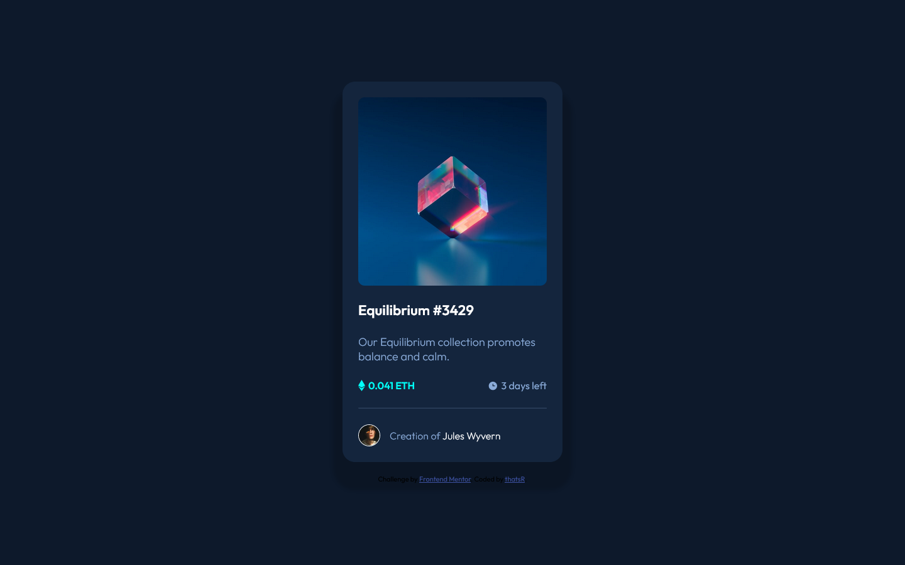

# Frontend Mentor - NFT preview card component solution

This is a solution to the [NFT preview card component challenge on Frontend Mentor](https://www.frontendmentor.io/challenges/nft-preview-card-component-SbdUL_w0U). Frontend Mentor challenges help you improve your coding skills by building realistic projects. 

## Overview

### The challenge

Users should be able to:

- View the optimal layout depending on their device's screen size
- See hover states for interactive elements

### Screenshot

### Links

- Solution URL: https://github.com/thatsR/FM-nft-preview-card-component.git
- Live Site URL: https://thatsr.github.io/FM-nft-preview-card-component

## My process

### Built with

- Semantic HTML5 markup
- CSS custom properties
- Flexbox
- Sass

### What I learned

First time using Sass and enjoyed using it.

## Author

- Frontend Mentor - [@thatsR](https://www.frontendmentor.io/profile/thatsR)
